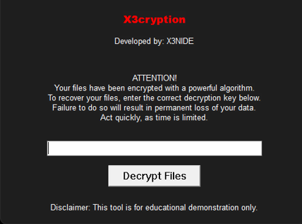

# X3cryption



## Overview

X3cryption is a demonstration tool designed to illustrate how ransomware operates by simulating file encryption and decryption processes using a simple XOR-based encryption algorithm. This tool is strictly for educational purposes and is intended to help users understand the mechanics of ransomware attacks.

## How It Works

1. **File Encryption**:
   - When the program starts, it encrypts all files in the current directory using a fixed encryption key (`x3cryption_key`).
   - The encryption is performed using the XOR operation, which toggles the bits of the file data based on the provided key.
   - Encrypted files are saved with a `.enc` extension, and the original files are deleted to simulate a real ransomware scenario.

2. **File Decryption**:
   - The user is prompted to enter a decryption key through a graphical user interface (GUI).
   - Upon providing the correct key, the tool will decrypt the `.enc` files in the directory, restoring them to their original form.
   - If the incorrect key is provided, the decryption process will not occur.

3. **User Interface**:
   - The tool features a simple GUI created with Windows API, which includes:
     - A password textbox for entering the decryption key.
     - A button to initiate the decryption process.
     - Warning messages that remind the user of the urgency to enter the decryption key.

## Important Notes

- **Educational Use Only**: X3cryption is meant solely for understanding how ransomware functions. The use of this tool in malicious activities is strictly prohibited.
- **Owner Responsibility**: The developer of this tool, X3NIDE, will not be held responsible for any harmful use or consequences arising from the misuse of this tool. By using this software, you acknowledge that you understand the risks involved and agree to use it responsibly.

## Compilation and Execution

To compile and run this project:

1. Make sure you have a C compiler (like MinGW for Windows).
2. Save the provided C code into a file named `x3cryption.c`.
3. Open your terminal or command prompt and navigate to the directory where `x3cryption.c` is saved.
4. Compile the code using the following command:
   ```bash
   gcc x3cryption.c -o x3cryption -mwindows
   ```
5. Execute the compiled program:
   ```bash
   x3cryption.exe
   ```

## Disclaimer

This tool is designed for educational purposes only. The author disclaims any responsibility for potential misuse or consequences of using this software. Users are urged to ensure that they operate within legal boundaries and ethical guidelines.

